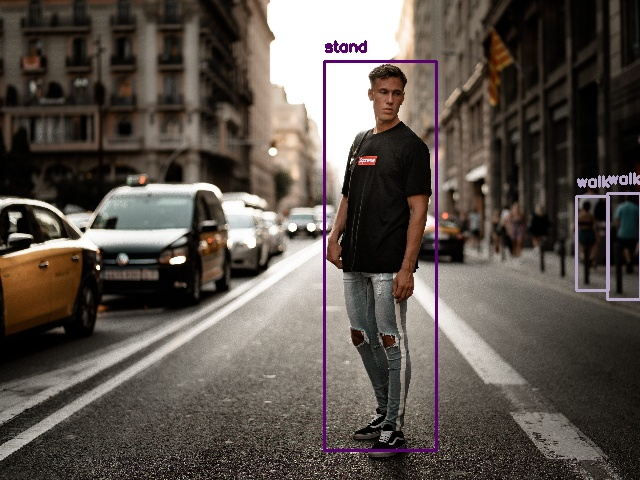

# Human Activity Detection with TensorFlow and Python


A simple baseline object detection model (Faster-RCNN with ResNet101 backbone) that can detect basic human activities like walking, running, sitting etc from image and video. The model is pre-trained on the [Google AVA Actions](https://research.google.com/ava/)  dataset which contains the bounding box annotations for 60 basic human actions like sit, stand, walk, run etc. The entire list can be found on the [label file](labels.txt).

## Installation
Install the dependencies using the commands below.
```
git clone https://github.com/visiongeeklabs/human-activity-detection.git
cd human-activity-detection
wget https://github.com/visiongeeklabs/human-activity-detection/releases/download/v0.1.0/frozen_inference_graph.pb
pip install -r requirements.txt
```

## Running inference on image
Run inference on image using the command below
```
python detect_activity_image.py /path/to/input/image

# For example
python detect_activity_image.py sample_inputs/input_image1.webp
```

## Running inference on video
Run inference on video using the command below
```
python detect_activity_video.py /path/to/input/video

# For example
python detect_activity_video.py sample_inputs/input_video.mp4
```

## Limitations
There are some known limitations to this model that need to be kept in mind while using it.
- It is an object detection model working on a single frame at a time. It doesn’t really have the memory of previous frames. For complex actions, it is important for the model to know what was happening in previous frames.
- Faster-RCNN with ResNet101 backbone is a heavy model. It is recommended to run on a reasonably powerful GPU for faster processing.
- Sometimes the same person might be doing multiple activities like watching a person while standing. The model produces separate bounding boxes for each activity for the same person which might make the output image clumsy (that is why we have omitted few classes from processing).

## Support on Patreon
If you are getting value out of this work, please consider supporting on [Patreon](https://www.patreon.com/arunponnusamy) and unlock exclusive perks such as 
- Downloadable PDFs
- Ready to run Google Colab notebooks 
- Early access to blog posts and video tutorials
- Hands-on live coding sessions and Q&A
- Access to exclusive Discord Server
